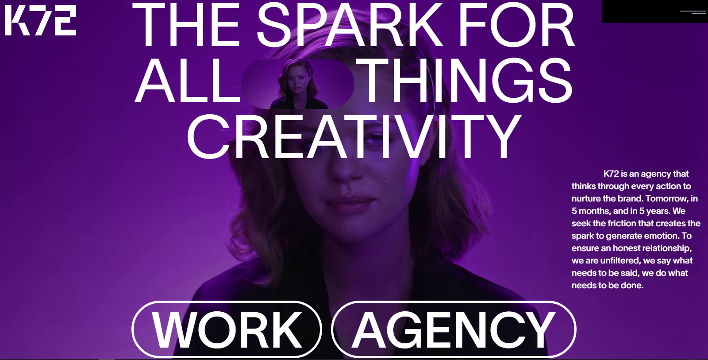
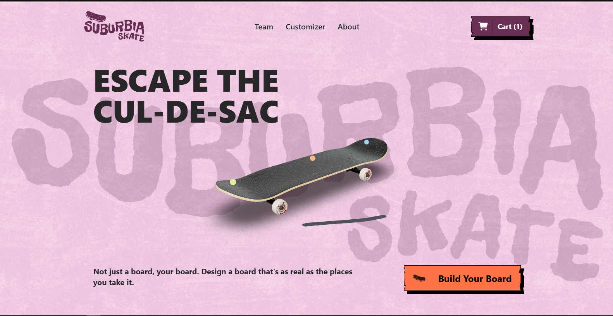
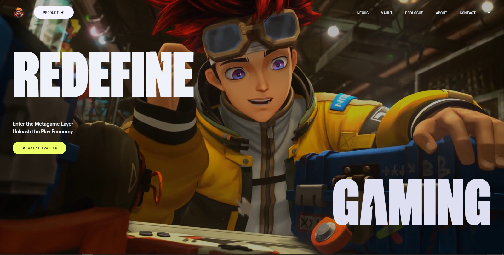
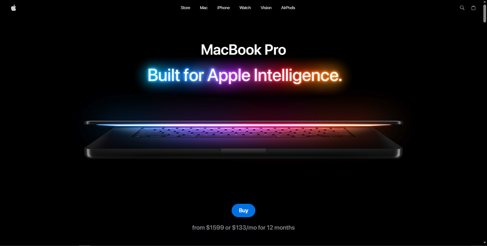
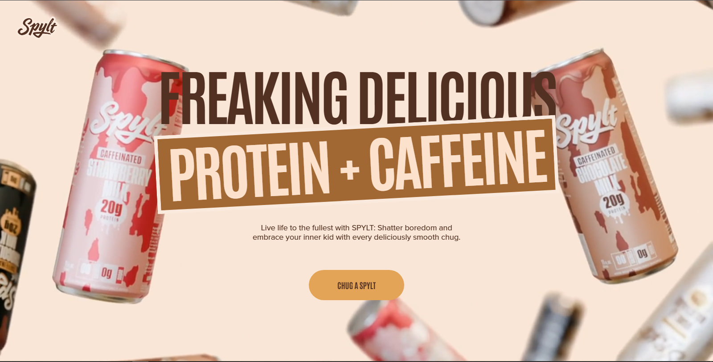
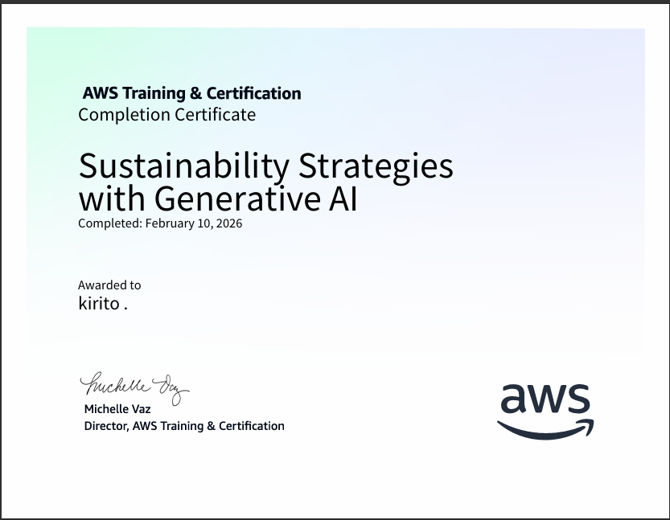
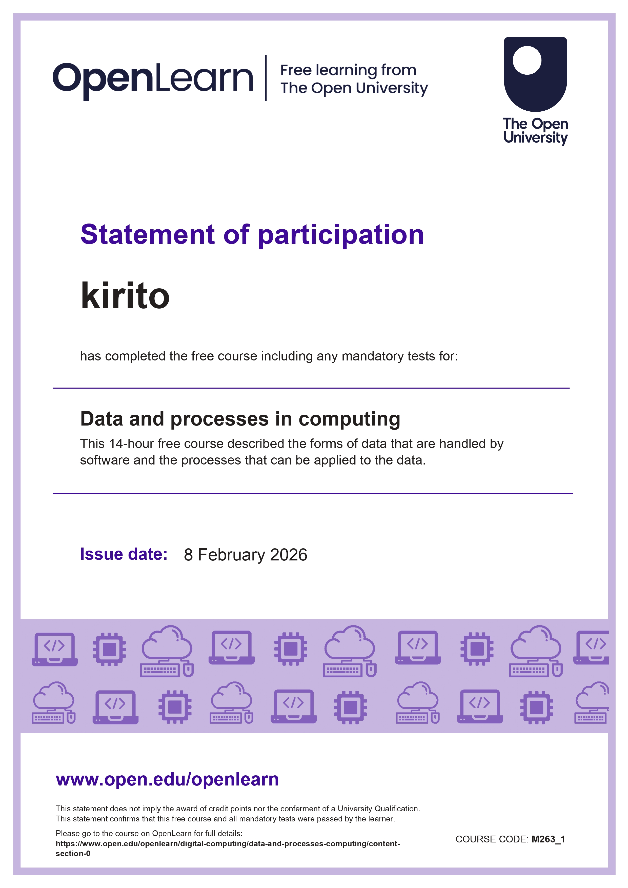
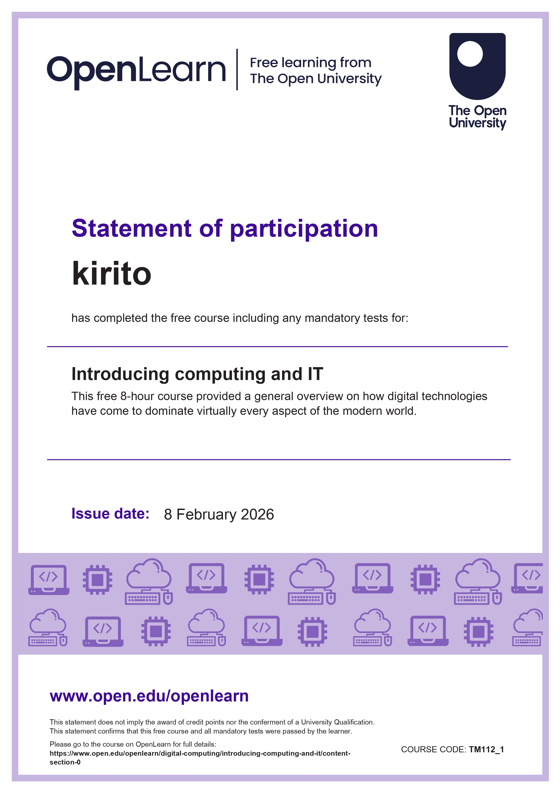

<h1 align="center">
  <picture>
    <!-- Dark mode -->
    <source media="(prefers-color-scheme: dark)" srcset="https://readme-typing-svg.herokuapp.com/?font=Righteous&size=35&center=true&vCenter=true&width=500&height=70&duration=4000&color=FFFFFF&lines=Hi+There!;+I'm+Kirito!;" />
    <!-- Light mode -->
    <source media="(prefers-color-scheme: light)" srcset="https://readme-typing-svg.herokuapp.com/?font=Righteous&size=35&center=true&vCenter=true&width=500&height=70&duration=4000&color=000000&lines=Hi+There!;+I'm+Kirito!;" />
    <!-- Fallback -->
    
  </picture>
</h1>

<h1 align="center">

</h1>

 

    
 

 

  
  

 

<h2 align="center"> Languages-Frameworks-Tools </h2>

  <h3>OS</h3>
  
  

  <h3>IDE</h3>
  
  

  <h3>Tools</h3>
  
  

  <h3>AI Tools</h3>
      
   

  <h3>Programming Languages</h3>
    

  <h3>Frontend Frameworks</h3>
  
   

  <h3>Frontend Libraries</h3>
 
   

  <h3>UI Libraries</h3>
 
   
  
  <h3>Backend Frameworks</h3>
  
   

  <h3>Backend Libraries</h3>
 
   

  <h3>Databases</h3>
 
 

  <h3>Dev Stack Utilities</h3>
 
   

  <h3>Dev Ops</h3>
 
   

  <h3>Cloud & Deployment</h3>
   
  

  <h3>Testing</h3>
   
   

  <h3>Mobile</h3>
   
   

  <h3>Mobile Libraries</h3>
   
   

 
 

 
<b> Tech Stack</b>

<table>
  <!-- Tools & Technologies Section -->
  <tr>
    <th colspan="6" style="text-align: center; font-size: 20px; padding: 10px;">Tools & Technologies</th>
  </tr>
  <tr>
  <td align="center">
       
      <b>Windows</b> 
      Development on Windows OS
    </td>
     <td align="center">
       
      <b>Linux</b> 
      Preferred OS for development
    </td>
    <td align="center">
       
      <b>VS Code</b> 
      Daily driver editor
    </td>
    <td align="center">
       
      <b>Git</b> 
      Confident with version control
    </td>
    <td align="center">
      
      <b>GitHub</b> 
      Actively pushing projects
    </td>
    <td align="center">
       
      <b>Node.js</b> 
      Building backend APIs
    </td>
  </tr>
  <tr>
      <td align="center">
     
      <b>Figma</b> 
      Proficient in UI/UX designing
    </td>
    <td align="center">
       
      <b>Postman</b> 
      API testing tool
    </td>
  </tr>

  <!-- Programming Languages Section -->
  <tr>
    <th colspan="6" style="text-align: center; font-size: 20px; padding: 10px;">Programming Languages</th>
  </tr>
  <tr>
    <td align="center">
       
      <b>HTML</b> 
      Used in 50+ projects
    </td>
    <td align="center">
       
      <b>CSS</b> 
      Intermediate level
    </td>
    <td align="center">
       
      <b>JavaScript</b> 
      Core language, confident
    </td>
    <td align="center">
       
      <b>TypeScript</b> 
      Used with React & Node
    </td>
    <td align="center">
       
      <b>Python</b> 
      Used in backend applications
    </td>
  </tr>

  <!-- Frameworks Section -->
  <tr>
    <th colspan="6" style="text-align: center; font-size: 20px; padding: 10px;">Frameworks</th>
  </tr>
  <tr>
    <td align="center">
       
      <b>Next.js</b> 
      SSR, fullstack app framework
    </td>
    <td align="center">
       
      <b>Angular</b> 
      Component-based frontend framework
    </td>
    <td align="center">
      
      <b>Express</b> 
      Used in MERN projects
    </td>
    <td align="center">
       
      <b>Django</b> 
      Web framework for Python
    </td>
   
  </tr>
 
  <!-- Libraries -->

 <tr>
    <th colspan="6" style="text-align: center; font-size: 20px; padding: 10px;">Libraries</th>
  </tr>
  <tr>
    <td align="center">
       
      <b>React</b> 
      Used in 40+ projects
    </td>
    <td align="center">
       
      <b>Tailwind CSS</b> 
      Preferred UI styling
    </td>
    <td align="center">
    
  <b>React Router DOM</b> 
  Declarative routing for React apps – I use it to handle dynamic pages and navigation.
</td>
    <td align="center">
   
  <b>Redux</b> 
  State management for JavaScript apps
</td>
<td align="center">
   
  <b>Axios</b> 
  Promise-based HTTP client for the browser and Node.js
</td>
 <td align="center">
  
  <b>Framer Motion</b> 
  I use Framer Motion daily for smooth, interactive animations in React. 
</td>
  </tr>
  <tr>
  <td align="center">
   
  <b>Zod</b> 
  Type-safe schema validation for TypeScript
</td>
<td align="center">
   
  <b>Zustand</b> 
  Fast and scalable state management for React
</td>
  </tr>
  <tr>
  <td align="center">
   
  <b>GSAP</b> 
  Powerful animation library for modern web interfaces
</td>
<td align="center">
   
  <b>Three.js</b> 
  3D web experiences with WebGL
</td>
  </tr>

  <tr>
    <td align="center">
     
    <b>JWT</b> 
    Secure token-based authentication for APIs
  </td>
  <td align="center">
  
    <b>Passport.js</b> 
    Simple, modular authentication middleware for Node.js
  </td>
  <td align="center">
    
    <b>OAuth</b> 
    Authorization protocol for secure third-party access
  </td>
  <td align="center">
   
  <b>Auth.js</b> 
  Authentication for modern web apps with Next.js and more
</td>
  <td align="center">
   
  <b>Socket.IO</b> 
  Real-time, bidirectional communication between web clients and servers
</td>
</tr>

<tr>
<th colspan="6" style="text-align: center; font-size: 20px; padding: 10px;">UI Libraries</th>
</tr>
<tr>
<td align="center">
  
  <b>shadcn UI</b> 
  Component library built on top of Radix UI & Tailwind CSS
</td>
<td align="center">
  
   
  <b>Skiper UI</b> 
  Beautiful, customizable React component library for modern dashboards
</td>
<td align="center">
   
  <b>Material UI</b> 
  React components for faster web development
</td>
<td align="center">
   
  <b>Chakra UI</b> 
  Accessible, modular, and themeable React component library
</td>
<td align="center">
   
  <b>Hero UI</b> 
  Modern, customizable UI kit for React applications
</td>
<td align="center">
   
  <b>Mantine UI</b> 
  Fully featured React component library with hooks and theming
</td>
  </tr>
  <tr>
  <td align="center">
   
  <b>Magic UI</b> 
  Animated React + Tailwind component library for designing interactive UIs
</td>

  </tr>

  <!-- Databases Section -->
  <tr>
    <th colspan="6" style="text-align: center; font-size: 20px; padding: 10px;">Databases</th>
  </tr>
  <tr>
    <td align="center">
       
      <b>MongoDB</b> 
      Database for most apps
    </td>
    <td align="center">
       
      <b>MySQL</b> 
      Relational database knowledge
    </td>
    <td align="center">
       
      <b>Redis</b> 
      In-memory database
    </td>
  </tr>

<!-- AI Tools Section -->
<tr>
  <th colspan="6" style="text-align: center; font-size: 20px; padding: 10px;">AI Tools</th>
</tr>
<tr>
  <td align="center">
     
    <b>ChatGPT</b> 
    AI Assistant for development
  </td>
  <td align="center">
     
    <b>Cursor</b> 
    AI-based code editor
  </td>
  <td align="center">
    
    <b>Pieces</b> 
    AI-powered dev assistant & workflow
  </td>
</tr>

<!-- Dev tools build tools -->
<tr>
  <th colspan="6" style="text-align: center; font-size: 20px; padding: 10px;">Dev Tools & Build Tools</th>
</tr>
<tr>
  <td align="center">
     
    <b>NPM</b> 
    JavaScript package manager
  </td>
  <td align="center">
   
  <b>pnpm</b> 
  Fast, disk space-efficient package manager
</td>

  <td align="center">
     
    <b>Vite</b> 
    Frontend build tool & dev server
  </td>
   <td align="center">
     
    <b>Docker</b> 
    Containerization tool
  </td>
  <td align="center">
     
    <b>Webpack</b> 
    Module bundler & build tool
  </td>
  <td align="center">
    
    <b>Clerk</b> 
    Authentication & user management
  </td>
</tr>
<tr>
<td align="center">
   
  <b>Prismic</b> 
  Headless CMS for flexible content creation and management
</td>
<td align="center">
   
  <b>Sanity</b> 
  Headless CMS for structured content and APIs
</td>

<td align="center">
   
  <b>Stripe</b> 
  Payments infrastructure for the internet
</td>
</tr>

 <!-- Cloud & Deployment-->
<tr>
  <th colspan="6" style="text-align: center; font-size: 20px; padding: 10px;">Cloud & Deployment</th>
</tr>
<tr>
<td align="center">
   
  <b>Cloudinary</b> 
  Media management & image hosting
</td>
  <td align="center">
     
    <b>AWS</b> 
    Cloud computing platform
  </td>
  <td align="center">
    
    <b>Vercel</b> 
    Frontend deployment platform
  </td>
  <td align="center">
   
  <b>Netlify</b> 
  Web app hosting
</td>
</tr>

<!-- Testing -->
  <tr>
    <th colspan="6" style="text-align: center; font-size: 20px; padding: 10px;">Testing Tools</th>
  </tr>
  <tr>
    <td align="center">
       
      <b>Jest</b> 
      Testing framework for JavaScript
    </td>
  </tr>

</table>

 

 
<b>GitHub Stats</b>

 <table>
  <tr>
    <td align="center"><strong>Github Stats</strong></td>
    <td align="center"><strong>Graph</strong></td>
  </tr>
  <tr>
    <td align="center">
      
    </td>
       <td width="50%">
        
         
        
      </td>
  </tr>
</table>

<table>
  <tr>
    <td align="center"><strong>GitHub Streak</strong></td>
    <td align="center"><strong>LeedCode Stats</strong></td>
  </tr>
  <tr>
    <td align="center" width="50%">
     
      <i> My Contributions </i>
       
    </td>
    <td align="center">
      
    </td>
  </tr>
</table>

 <table>
  <tr>
    <td align="center"><strong>Most Used Languages</strong></td>
    <td align="center"><strong>Waka Time</strong></td>
  </tr>
  <tr>
    <td align="center" width="50%">
    
    </td>
      <td> 
      
      </td>
     
  </tr>
</table>

 

 
<b>Project</b>

<h3 align="center">Website</h3>

<a><---Old</a>
<table align="center" style="border: 1px solid">
      <thead align="center">
        <tr align="center">
          <th align="center" style="border: 1px solid">K72</th>
          <th align="center" style="border: 1px solid">Suburbia</th>
          <th align="center" style="border: 1px solid">zentry</th>
          <th align="center" style="border: 1px solid">mojito</th>
          <th align="center" style="border: 1px solid">macBook</th>
        </tr>
      </thead>
      <tbody align="center">
        <tr>
          <td style="border: 1px solid">
            
          </td>
          <td style="border: 1px solid">
            
          </td>
          <td style="border: 1px solid">
            
          </td>
          <td style="border: 1px solid">
            
          </td>
          <td style="border: 1px solid">
            
          </td>
        </tr>
      </tbody>
       <tfoot align="center">
    <tr>
      <td style="border: 1px solid">
        <a href="https://github.com/kirito666coder/k72.git" target="_blank" rel="noopener noreferrer">
          Repository
        </a>
      </td>
      <td style="border: 1px solid">
        <a href="https://github.com/kirito666coder/suburrbia.git" target="_blank" rel="noopener noreferrer">
          Repository
        </a>
      </td>
      <td style="border: 1px solid">
        <a href="https://github.com/kirito666coder/zentry.git" target="_blank" rel="noopener noreferrer">
          Repository
        </a>
      </td>
      <td style="border: 1px solid">
        <a href="https://github.com/kirito666coder/mojito-cocktail.git" target="_blank" rel="noopener noreferrer">
          Repository
        </a>
      </td>
      <td style="border: 1px solid">
        <a href="https://github.com/kirito666coder/apple-website.git" target="_blank" rel="noopener noreferrer">
          Repository
        </a>
      </td>
    </tr>
  </tfoot>
    </table>
<table align="center" style="border: 1px solid">
      <thead align="center">
        <tr align="center">
          <th align="center" style="border: 1px solid">Dog Studio</th>
          <th align="center" style="border: 1px solid">spylt</th>
        </tr>
      </thead>
      <tbody align="center">
        <tr>
          <td style="border: 1px solid">
            
          </td>
           <td style="border: 1px solid">
            
          </td>
        </tr>
      </tbody>
       <tfoot align="center">
    <tr>
      <td style="border: 1px solid">
        <a href="https://github.com/kirito666coder/dogstudio-c.git" target="_blank" rel="noopener noreferrer">
          Repository
        </a>
      </td>
            <td style="border: 1px solid">
        <a href="https://github.com/kirito666coder/spylt.git" target="_blank" rel="noopener noreferrer">
          Repository
        </a>
      </td>
    </tr>
  </tfoot>
    </table>
   
<a>New ---></a>

   

<h3 align="center">Application</h3>

   
<a><--- Old</a>

   <table align="center" border="1">

<thead align="center">
  <tr>
    <th align="center">RnMovies</th>
  </tr>
</thead>

<tbody align="center">
  <tr>
    <!-- FIRST APP -->
    <td>
      
A React Native Movie Application

      <table align="center">
        <tr>
          <td>
            
          </td>
          <td>
            
          </td>
        </tr>
      </table>
    </td>
    <!-- SECOND APP -->

  </tr>
</tbody>

</table>

  
<a>New ---></a>

 

 
<b>About Me</b>

 

    
 

<table align="center">
<tr>

<td width="70%">

## Fun Facts

> [!CAUTION]
> **Fun Fact:**  
> Everyone keeps asking how I’m pushing code to GitHub from 1985.  
> Simple answer – my dad was there first.

> [!TIP]
> People wonder how I commit from 1985.  
> Time machine = Dad.

> [!IMPORTANT]
> They asked: “Bro GitHub didn’t exist in 1985!”  
> I said: “Neither did I… but my dad did.”

</td>

<td width="30%" align="center">

 <video src="https://github.com/user-attachments/assets/a9d83d4e-1416-424a-b35d-ab999f33a59f" width="260" controls>
  </video>

</td>

</tr>
</table>

 
<b>Certificates</b>

<table align="center" width="100%" style="border: 1px solid">

  <thead align="center">
    <tr align="center">
      <th colspan="4" style="border: 1px solid; padding: 10px; font-size: 19px;">
        AWS Skill Builder
      </th>
    </tr>
  <tr align="center">
      <th style="border: 1px solid">generative-ai</th>
      <th style="border: 1px solid">devops on aws</th>
      <th style="border: 1px solid"></th>
      <th style="border: 1px solid"></th>
    </tr>
  </thead>
  <tbody align="center">
    <tr>
        <td style="border: 1px solid">
          
      </td>
        <td style="border: 1px solid">
          
      </td>
      <td style="border: 1px solid"></td>
      <td style="border: 1px solid"></td>
    </tr>

  </tbody>

</table>

<table align="center" width="100%" style="border: 1px solid">

  <thead align="center">
    <tr align="center">
      <th colspan="4" style="border: 1px solid; padding: 10px; font-size: 19px;">
        HackerRank
      </th>
    </tr>
  <tr align="center">
      <th style="border: 1px solid">Frontend (React)</th>
      <th style="border: 1px solid"></th>
      <th style="border: 1px solid"></th>
      <th style="border: 1px solid"></th>
    </tr>
  </thead>
  <tbody align="center">
    <tr>
        <td style="border: 1px solid">
          
      </td>
      <td style="border: 1px solid"></td>
      <td style="border: 1px solid"></td>
      <td style="border: 1px solid"></td>
    </tr>

  </tbody>

</table>

<table align="center" width="100%" style="border: 1px solid">

  <thead align="center">
    <tr align="center">
      <th colspan="4" style="border: 1px solid; padding: 10px; font-size: 19px;">
        Simplilearn Certificates
      </th>
    </tr>
    <tr align="center">
      <th style="border: 1px solid">AWS Billing</th>
      <th style="border: 1px solid">AWS Compute Overview</th>
      <th style="border: 1px solid">AWS DevOps</th>
      <th style="border: 1px solid">AWS API Gateway</th>
    </tr>
  </thead>

  <tbody align="center">
    <tr>
      <td style="border: 1px solid">
          
      </td>
      <td style="border: 1px solid">
          
      </td>
      <td style="border: 1px solid">
          
      </td>
      <td style="border: 1px solid">
          
      </td>
    </tr>
    <tr align="center">
      <th style="border: 1px solid">AWS Inferentia</th>
      <th style="border: 1px solid">AWS Lambda</th>
        <th style="border: 1px solid">GitHub Copilot</th>
        <th style="border: 1px solid">Copilot Prompt Eng</th>
    </tr>
    <tr>
      <td style="border: 1px solid">
          
      </td>
      <td style="border: 1px solid">
          
      </td>
       <td style="border: 1px solid">
          
      </td>
       <td style="border: 1px solid">
          
      </td>
    </tr>
    <tr align="center">
      <th style="border: 1px solid">Intro to Gen AI</th>
      <th style="border: 1px solid">Intro to LLMs</th>
      <th style="border: 1px solid">Google Gemini</th>
      <th style="border: 1px solid">Gen AI Studio</th>
    </tr>
    <tr>
     <td style="border: 1px solid">
          
      </td>
      <td style="border: 1px solid">
          
      </td>
      <td style="border: 1px solid">
          
      </td>
      <td style="border: 1px solid">
          
      </td>
    </tr>
    <tr align="center">
     <th style="border: 1px solid">Design Thinking</th>
      <th style="border: 1px solid">GitHub Basics</th>
      <th style="border: 1px solid">Android Studio</th>
         <th style="border: 1px solid">Databricks SQL BI</th>
    </tr>
    <tr>
     <td style="border: 1px solid">
          
      </td>
      <td style="border: 1px solid">
          
      </td>
      <td style="border: 1px solid">
          
      </td>
      <td style="border: 1px solid">
          
      </td>
    </tr>
    <tr align="center">
      <th style="border: 1px solid">Agentic AI Apps</th>
      <th style="border: 1px solid"></th>
      <th style="border: 1px solid"></th>
      <th style="border: 1px solid"></th>
    </tr>
    <tr>
        <td style="border: 1px solid">
          
      </td>
      <td style="border: 1px solid"></td>
      <td style="border: 1px solid"></td>
      <td style="border: 1px solid"></td>
    </tr>

  </tbody>

</table>

<table align="center" width="100%" style="border: 1px solid">

  <thead align="center">
    <tr align="center">
      <th colspan="4" style="border: 1px solid; padding: 10px; font-size: 19px;">
        Open learn Certificates
      </th>
    </tr>
    <tr align="center">
      <th style="border: 1px solid">Intro to Computer sys</th>
      <th style="border: 1px solid">Dev Approaches</th>
      <th style="border: 1px solid">Computing Data & Processes</th>
      <th style="border: 1px solid">Intro to Computer & IT</th>
    </tr>
  </thead>

  <tbody align="center">
    <tr>
      <td style="border: 1px solid">
          
      </td>
      <td style="border: 1px solid">
          
      </td>
      <td style="border: 1px solid">
          
      </td>
      <td style="border: 1px solid">
          
      </td>
    </tr>
    <tr align="center">
      <th style="border: 1px solid">Intro to Dev</th>
      <th style="border: 1px solid">Network Security</th>
      <th style="border: 1px solid">Simple Coding</th>
      <th style="border: 1px solid">Dev Architecture</th>
    </tr>
    <tr>
      <td style="border: 1px solid">
          
      </td>
      <td style="border: 1px solid">
          
      </td>
      <td style="border: 1px solid">
          
      </td>
      <td style="border: 1px solid">
          
      </td>
    </tr>
    <tr align="center">
      <th style="border: 1px solid">Enterprise Dev</th>
      <th style="border: 1px solid">DB Dev Lifecycle</th>
      <th style="border: 1px solid"></th>
      <th style="border: 1px solid"></th>
    </tr>
    <tr>
      <td style="border: 1px solid">
          
      </td>
      <td style="border: 1px solid">
          
      </td>
      <td style="border: 1px solid">
      </td>
      <td style="border: 1px solid">
      </td>
    </tr>

  </tbody>

</table>

 

<picture>
  <source media="(prefers-color-scheme: dark)" srcset="https://raw.githubusercontent.com/kirito666coder/kirito666coder/output/pacman-contribution-graph-dark.svg">
  <source media="(prefers-color-scheme: light)" srcset="https://raw.githubusercontent.com/kirito666coder/kirito666coder/output/pacman-contribution-graph.svg">
  
</picture>

