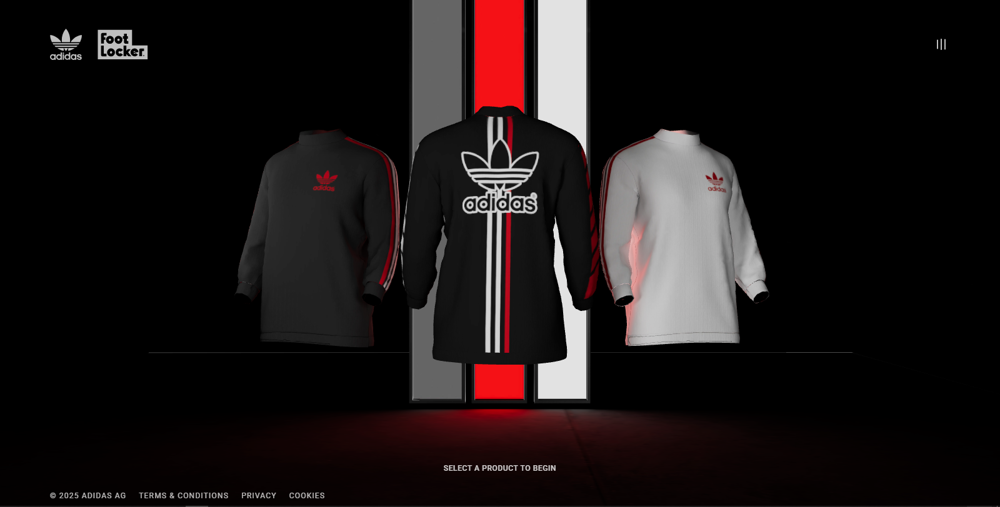
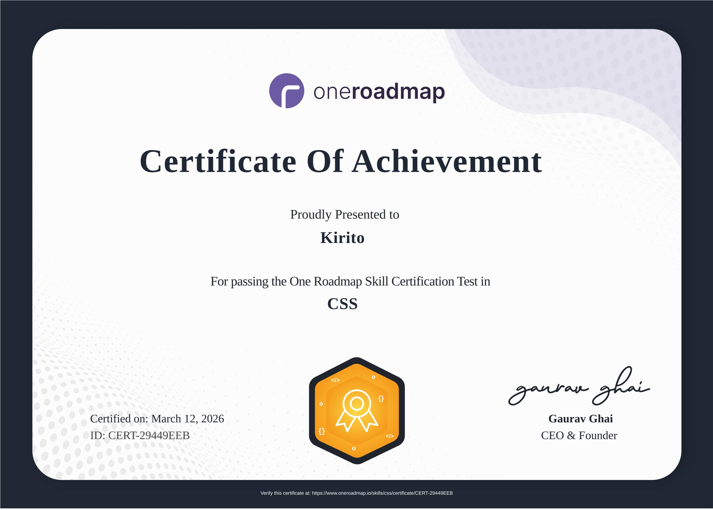

<h1 align="center">
  <picture>
    <!-- Dark mode -->
    <source media="(prefers-color-scheme: dark)" srcset="https://readme-typing-svg.herokuapp.com/?font=Righteous&size=35&center=true&vCenter=true&width=500&height=70&duration=4000&color=FFFFFF&lines=Hi+There!;+I'm+Kirito!;" />
    <!-- Light mode -->
    <source media="(prefers-color-scheme: light)" srcset="https://readme-typing-svg.herokuapp.com/?font=Righteous&size=35&center=true&vCenter=true&width=500&height=70&duration=4000&color=000000&lines=Hi+There!;+I'm+Kirito!;" />
    <!-- Fallback -->
    
  </picture>
</h1>

<h1 align="center">

</h1>

 

    
 

 

  
  

  

<b> Languages-Frameworks-Tools </b>

  <h3>OS</h3>
  
  

  <h3>IDE</h3>
  
  

  <h3>Tools</h3>
  
  

  <h3>AI Tools</h3>
      
   

  <h3>Programming Languages</h3>
    

  <h3>Frontend Frameworks</h3>
  
   

  <h3>Frontend Libraries</h3>
 
   

  <h3>UI Libraries</h3>
 
   
  
  <h3>Backend Frameworks</h3>
  
   

  <h3>Backend Libraries</h3>
 
   

  <h3>Databases</h3>
 
 

  <h3>Dev Stack Utilities</h3>
 
   

  <h3>Dev Ops</h3>
 
   

  <h3>Cloud & Deployment</h3>
   
  

  <h3>Testing</h3>
   
   

  <h3>Mobile</h3>
   
   

  <h3>Mobile Libraries</h3>
   
   

 
 

 
<b> details</b>

<table>
  <!-- OS Section -->
  <tr>
    <th colspan="5" style="text-align: center; font-size: 20px; padding: 10px;">OS</th>
  </tr>
  <tr>
    <td align="center">
       
      <b>Windows</b> 
      Development on Windows OS
    </td>
    <td align="center">
       
      <b>Ubuntu</b> 
      Preferred OS for development
    </td>
  </tr>
  <!-- IDE Section -->
  <tr>
    <th colspan="5" style="text-align: center; font-size: 20px; padding: 10px;">IDE</th>
  </tr>
  <tr>
    <td align="center">
       
      <b>VS Code</b> 
      Daily driver editor
    </td>
    <td align="center">
       
      <b>AntiGravity</b> 
      AI-powered dev environment
    </td>
    <td align="center">
       
      <b>Cursor</b> 
      AI-based code editor
    </td>
    <td align="center">
       
      <b>Android Studio</b> 
      For native mobile development
    </td>
  </tr>
  <!-- Tools Section -->
  <tr>
    <th colspan="5" style="text-align: center; font-size: 20px; padding: 10px;">Tools</th>
  </tr>
  <tr>
    <td align="center">
       
      <b>GitHub</b> 
      Actively pushing projects
    </td>
    <td align="center">
       
      <b>Figma</b> 
      Proficient in UI/UX designing
    </td>
    <td align="center">
       
      <b>Postman</b> 
      API testing tool
    </td>
  </tr>
  <!-- AI Tools Section -->
  <tr>
    <th colspan="5" style="text-align: center; font-size: 20px; padding: 10px;">AI Tools</th>
  </tr>
  <tr>
    <td align="center">
       
      <b>ChatGPT</b> 
      AI Assistant for development
    </td>
    <td align="center">
       
      <b>Claude</b> 
      Advanced AI for complex tasks
    </td>
    <td align="center">
       
      <b>Gemini</b> 
      AI model for versatile use
    </td>
    <td align="center">
       
      <b>Pieces</b> 
      AI-powered dev assistant
    </td>
  </tr>
  <!-- Programming Languages Section -->
  <tr>
    <th colspan="5" style="text-align: center; font-size: 20px; padding: 10px;">Programming Languages</th>
  </tr>
  <tr>
    <td align="center">
       
      <b>HTML</b> 
      Used in 50+ projects
    </td>
    <td align="center">
       
      <b>CSS</b> 
      Intermediate level
    </td>
    <td align="center">
       
      <b>JavaScript</b> 
      Core language, confident
    </td>
    <td align="center">
       
      <b>TypeScript</b> 
      Used with React & Node
    </td>
    <td align="center">
       
      <b>Python</b> 
      Used in backend applications
    </td>
  </tr>
  <!-- Frontend Frameworks Section -->
  <tr>
    <th colspan="5" style="text-align: center; font-size: 20px; padding: 10px;">Frontend Frameworks</th>
  </tr>
  <tr>
    <td align="center">
       
      <b>Next.js</b> 
      SSR, fullstack app framework
    </td>
  </tr>
  <!-- Frontend Libraries Section -->
  <tr>
    <th colspan="5" style="text-align: center; font-size: 20px; padding: 10px;">Frontend Libraries</th>
  </tr>
  <tr>
    <td align="center">
       
      <b>React</b> 
      Used in 40+ projects
    </td>
    <td align="center">
       
      <b>Tailwind CSS</b> 
      Preferred UI styling
    </td>
    <td align="center">
       
      <b>Redux</b> 
      State management for JS apps
    </td>
    <td align="center">
       
      <b>Zustand</b> 
      Fast and scalable state management
    </td>
    <td align="center">
       
      <b>React Router DOM</b> 
      Declarative routing for React apps
    </td>
  </tr>
  <tr>
    <td align="center">
       
      <b>Framer Motion</b> 
      Smooth, interactive animations
    </td>
    <td align="center">
       
      <b>GSAP</b> 
      Powerful animation library
    </td>
    <td align="center">
       
      <b>Three.js</b> 
      3D web experiences with WebGL
    </td>
  </tr>
  <!-- UI Libraries Section -->
  <tr>
    <th colspan="5" style="text-align: center; font-size: 20px; padding: 10px;">UI Libraries</th>
  </tr>
  <tr>
    <td align="center">
       
      <b>Material UI</b> 
      React components for faster dev
    </td>
    <td align="center">
       
      <b>shadcn UI</b> 
      Component library built with Radix
    </td>
    <td align="center">
       
      <b>Skiper UI</b> 
      Beautiful React component library
    </td>
    <td align="center">
       
      <b>Chakra UI</b> 
      Accessible component library
    </td>
    <td align="center">
       
      <b>Hero UI</b> 
      Modern UI kit for React applications
    </td>
  </tr>
  <tr>
    <td align="center">
       
      <b>Mantine UI</b> 
      Fully featured React components
    </td>
    <td align="center">
       
      <b>Magic UI</b> 
      Animated React component library
    </td>
  </tr>
  <!-- Backend Frameworks Section -->
  <tr>
    <th colspan="5" style="text-align: center; font-size: 20px; padding: 10px;">Backend Frameworks</th>
  </tr>
  <tr>
    <td align="center">
       
      <b>Express</b> 
      Used in MERN projects
    </td>
  </tr>
  <!-- Backend Libraries Section -->
  <tr>
    <th colspan="5" style="text-align: center; font-size: 20px; padding: 10px;">Backend Libraries</th>
  </tr>
  <tr>
    <td align="center">
       
      <b>Zod</b> 
      Type-safe schema validation
    </td>
    <td align="center">
       
      <b>Passport.js</b> 
      Authentication middleware for Node.js
    </td>
    <td align="center">
       
      <b>JWT</b> 
      Secure token-based authentication
    </td>
    <td align="center">
       
      <b>OAuth</b> 
      Secure third-party access
    </td>
    <td align="center">
       
      <b>Auth.js</b> 
      Authentication for modern web apps
    </td>
  </tr>
  <tr>
    <td align="center">
       
      <b>Socket.IO</b> 
      Real-time communication
    </td>
  </tr>
  <!-- Databases Section -->
  <tr>
    <th colspan="5" style="text-align: center; font-size: 20px; padding: 10px;">Databases</th>
  </tr>
  <tr>
    <td align="center">
       
      <b>MongoDB</b> 
      Database for most applications
    </td>
    <td align="center">
       
      <b>MySQL</b> 
      Relational database knowledge
    </td>
    <td align="center">
       
      <b>Redis</b> 
      In-memory database
    </td>
  </tr>
  <!-- Dev Stack Utilities Section -->
  <tr>
    <th colspan="5" style="text-align: center; font-size: 20px; padding: 10px;">Dev Stack Utilities</th>
  </tr>
  <tr>
    <td align="center">
       
      <b>Vite</b> 
      Frontend build tool & dev server
    </td>
    <td align="center">
       
      <b>NPM</b> 
      JavaScript package manager
    </td>
    <td align="center">
       
      <b>pnpm</b> 
      Disk space-efficient package manager
    </td>
    <td align="center">
       
      <b>Clerk</b> 
      Authentication & user management
    </td>
    <td align="center">
       
      <b>Inngest</b> 
      Event-driven background jobs
    </td>
  </tr>
  <tr>
    <td align="center">
       
      <b>Prismic</b> 
      Headless CMS for flexible content
    </td>
    <td align="center">
       
      <b>Sanity</b> 
      Headless CMS for structured content
    </td>
    <td align="center">
       
      <b>Stripe</b> 
      Payments infrastructure
    </td>
  </tr>
  <!-- Dev Ops Section -->
  <tr>
    <th colspan="5" style="text-align: center; font-size: 20px; padding: 10px;">Dev Ops</th>
  </tr>
  <tr>
    <td align="center">
       
      <b>Docker</b> 
      Containerization tool
    </td>
    <td align="center">
       
      <b>Kubernetes</b> 
      Container orchestration platform
    </td>
    <td align="center">
       
      <b>Jenkins</b> 
      Automation server for CI/CD
    </td>
  </tr>
  <!-- Cloud & Deployment Section -->
  <tr>
    <th colspan="5" style="text-align: center; font-size: 20px; padding: 10px;">Cloud & Deployment</th>
  </tr>
  <tr>
    <td align="center">
       
      <b>Cloudinary</b> 
      Media management & hosting
    </td>
    <td align="center">
       
      <b>AWS</b> 
      Cloud computing platform
    </td>
    <td align="center">
       
      <b>Vercel</b> 
      Frontend deployment platform
    </td>
    <td align="center">
       
      <b>Netlify</b> 
      Web app hosting
    </td>
  </tr>
  <!-- Testing Section -->
  <tr>
    <th colspan="5" style="text-align: center; font-size: 20px; padding: 10px;">Testing</th>
  </tr>
  <tr>
    <td align="center">
       
      <b>Jest</b> 
      Testing framework for JavaScript
    </td>
  </tr>
  <!-- Mobile Section -->
  <tr>
    <th colspan="5" style="text-align: center; font-size: 20px; padding: 10px;">Mobile</th>
  </tr>
  <tr>
    <td align="center">
       
      <b>React Native</b> 
      Building cross-platform apps
    </td>
    <td align="center">
       
      <b>Expo</b> 
      Universal React applications
    </td>
  </tr>
  <!-- Mobile Libraries Section -->
  <tr>
    <th colspan="5" style="text-align: center; font-size: 20px; padding: 10px;">Mobile Libraries</th>
  </tr>
  <tr>
    <td align="center">
       
      <b>Nativewind</b> 
      Tailwind CSS for React Native
    </td>
  </tr>
</table>

 

 
<b>GitHub Stats</b>

 <table>
  <tr>
    <td align="center"><strong>Github Stats</strong></td>
    <td align="center"><strong>Graph</strong></td>
  </tr>
  <tr>
    <td align="center">
      
    </td>
       <td width="50%">
          
         
        
      </td>
  </tr>
</table>

<table>
  <tr>
    <td align="center"><strong>GitHub Streak</strong></td>
    <td align="center"><strong>LeedCode Stats</strong></td>
  </tr>
  <tr>
    <td align="center" width="50%">
     
      <i> My Contributions </i>
       
    </td>
    <td align="center">
      
    </td>
  </tr>
</table>

 <table>
  <tr>
    <td align="center"><strong>Most Used Languages</strong></td>
    <td align="center"><strong>Waka Time</strong></td>
  </tr>
  <tr>
    <td align="center" width="50%">
    
    </td>
      <td> 
      
      
      </td>
     
  </tr>
</table>

 

 
<b>Project</b>

<table>
<tr>
<td style="border: 1px solid">

> [!CAUTION]
> Some **legacy projects** may not function as expected due to **deprecated dependencies**, **API changes**, **service limitations**, or **hosting restrictions**.
>
> These projects are **no longer actively maintained**.

> [!NOTE]
> They are preserved to reflect my development journey and progression.

> [!TIP]
> **New projects follow modern best practices, improved architecture, cleaner code structure, performance optimizations, and scalable design patterns.**

> [!IMPORTANT]
> Please refer to the **New** section for the most up-to-date and production-ready work.

</td>
</tr>
</table>

<h3 align="center">Website Clone Projects (Learning)</h3>

<a><---Old</a>

<table align="center" style="border: 1px solid">
      <thead align="center">
        <tr align="center">
          <th align="center" style="border: 1px solid">K72</th>
          <th align="center" style="border: 1px solid">Suburbia</th>
          <th align="center" style="border: 1px solid">zentry</th>
          <th align="center" style="border: 1px solid">mojito</th>
          <th align="center" style="border: 1px solid">macBook</th>
        </tr>
      </thead>
      <tbody align="center">
        <tr>
          <td style="border: 1px solid">
            
          </td>
          <td style="border: 1px solid">
            
          </td>
          <td style="border: 1px solid">
            
          </td>
          <td style="border: 1px solid">
            
          </td>
          <td style="border: 1px solid">
            
          </td>
        </tr>
      </tbody>
       <tfoot align="center">
    <tr>
      <td style="border: 1px solid">
        
      </td>
      <td style="border: 1px solid">
        
      </td>
      <td style="border: 1px solid">
        
      </td>
      <td style="border: 1px solid">
        
      </td>
      <td style="border: 1px solid">
        
      </td>
    </tr>
  </tfoot>
    </table>
<table align="center" style="border: 1px solid">
      <thead align="center">
        <tr align="center">
          <th align="center" style="border: 1px solid">Dog Studio</th>
          <th align="center" style="border: 1px solid">spylt</th>
          <th align="center" style="border: 1px solid">Nimbus</th>
          <th align="center" style="border: 1px solid">Adidas</th>
        </tr>
      </thead>
      <tbody align="center">
        <tr>
          <td style="border: 1px solid">
            
          </td>
           <td style="border: 1px solid">
            
          </td>
           <td style="border: 1px solid">
            
          </td>
          </td>
           <td style="border: 1px solid">
            
          </td>
        </tr>
      </tbody>
       <tfoot align="center">
    <tr>
      <td style="border: 1px solid">
        
      </td>
            <td style="border: 1px solid">
        
      </td>
            <td style="border: 1px solid">
        
      </td>
            <td style="border: 1px solid">
        
      </td>
    </tr>
  </tfoot>
    </table>
   
<a>New ---></a>

   

<h3 align="center">Full Stack</h3>

   
<a><--- Old</a>

 <table align="center" style="border: 1px solid">
      <thead align="center">
        <tr align="center">
          <th align="center" style="border: 1px solid">FocusMeet</th>
          <th align="center" style="border: 1px solid">
MERN Music Hub</th>
          <th align="center" style="border: 1px solid">Shop Cart</th>
        </tr>
      </thead>
      <tbody align="center">
        <tr>
          <td style="border: 1px solid">
            
          </td>
           <td style="border: 1px solid">
            
          </td>
           <td style="border: 1px solid">
            
          </td>
        </tr>
      </tbody>
       <tfoot align="center">
    <tr>
      <td style="border: 1px solid">
        
      </td>
            <td style="border: 1px solid">
        
      </td>
            <td style="border: 1px solid">
        
      </td>
    </tr>
  </tfoot>
    </table>
  
<a>New ---></a>

<h3 align="center">Application</h3>

   
<a><--- Old</a>

   <table align="center" border="1">

<thead align="center">
  <tr>
    <th align="center">Expo-Ecommerce</th>
  </tr>
</thead>

<tbody align="center">
  <tr>
    <!-- FIRST APP -->
     <td>
            
      <table align="center">
        <tr>
          <td>
            
          </td>
          <td>
            
          </td>
        </tr>
      </table>
    </td>
    <!-- SECOND APP -->

  </tr>
</tbody>

</table>

  
<a>New ---></a>

 

 
<b>About Me</b>

 

    
 

<table align="center">
<tr>

<h2 align="center">KIRITO</h2>

Self-Taught Developer • Building for Fun

---

I'm a self-taught developer with no computer science background.  
I didn’t study CS in school or college — I started coding after dropping out of college.

Everything I know comes from building, experimenting, and learning on my own.

---

Most people get into programming for jobs, money, or career growth.  
**That’s not why I’m here.**

I code because I enjoy it.  
It’s not a backup plan — **it’s something I choose.**

---

I build projects to:

- learn
- experiment
- push my limits

They’re not meant to follow traditional paths or expectations — and I’m fine with that.

---

**This isn’t about proving anything to anyone.**

I’m here to build what I like, improve every day,  
and enjoy the process — on my own terms.

<td width="70%">

## Fun Facts

> [!CAUTION]
> **Fun Fact:**  
> Everyone keeps asking how I’m pushing code to GitHub from 1985.  
> Simple answer – my dad was there first.

> [!TIP]
> People wonder how I commit from 1985.  
> Time machine = Dad.

> [!IMPORTANT]
> They asked: “Bro GitHub didn’t exist in 1985!”  
> I said: “Neither did I… but my dad did.”

</td>

<td width="30%" align="center">

 <video src="https://github.com/user-attachments/assets/a9d83d4e-1416-424a-b35d-ab999f33a59f" width="260" controls>
  </video>

</td>

</tr>
</table>

 
<b>(Skip) Here are a few certificates that may not be important.</b>

 <table align="center" width="100%" style="border: 1px solid">

  <thead align="center">
    <tr align="center">
      <th colspan="4" style="border: 1px solid; padding: 10px; font-size: 19px;">
        
      </th>
    </tr>
  <tr align="center">
      <th style="border: 1px solid">responsive web design</th>
      <!-- <th style="border: 1px solid"></th>
      <th style="border: 1px solid"></th>
      <th style="border: 1px solid"></th> -->
    </tr>
  </thead>
  <tbody align="center">
    <tr>
        <td style="border: 1px solid">
          
      </td>
      <!-- <td style="border: 1px solid"></td>
      <td style="border: 1px solid"></td>
      <td style="border: 1px solid"></td> -->
    </tr>
    <!-- verify button row -->
    <tr>
      <td style="border: 1px solid; padding: 10px;">
        <a href="https://www.freecodecamp.org/certification/fcc-1c3f4a9f-9bd9-4410-b27c-c028e37e2b24/responsive-web-design-v9" target="_blank">
          Verify Certificate
        </a>
      </td>
    </tr>

  </tbody>

</table>

<table align="center" width="100%" style="border: 1px solid">

  <thead align="center">
    <tr align="center">
      <th colspan="4" style="border: 1px solid; padding: 10px; font-size: 19px;">
        
      </th>
    </tr>
  <tr align="center">
      <th style="border: 1px solid">generative-ai</th>
      <th style="border: 1px solid">devops on aws</th>
      <!-- <th style="border: 1px solid"></th>
      <th style="border: 1px solid"></th> -->
    </tr>
  </thead>
  <tbody align="center">
    <tr>
        <td style="border: 1px solid">
          
      </td>
        <td style="border: 1px solid">
          
      </td>
      <!-- <td style="border: 1px solid"></td>
      <td style="border: 1px solid"></td> -->
    </tr>

  </tbody>

</table>

<table align="center" width="100%" style="border: 1px solid">

  <thead align="center">
    <tr align="center">
      <th colspan="4" style="border: 1px solid; padding: 10px; font-size: 19px;">
        
      </th>
    </tr>
  <tr align="center">
      <th style="border: 1px solid">web Development</th>
      <!-- <th style="border: 1px solid"></th>
      <th style="border: 1px solid"></th>
      <th style="border: 1px solid"></th> -->
    </tr>
  </thead>
  <tbody align="center">
    <tr>
        <td style="border: 1px solid">
          
      </td>
      <!-- <td style="border: 1px solid"></td>
      <td style="border: 1px solid"></td>
      <td style="border: 1px solid"></td> -->
    </tr>
    <tr>
      <td style="border: 1px solid; padding: 10px;">
        <a href="https://www.credly.com/badges/52d390ce-2cad-4a8e-b183-cc610efaec90/public_url" target="_blank">
          Verify Certificate
        </a>
      </td>
    </tr>

  </tbody>

</table>

<table align="center" width="100%" style="border: 1px solid">

  <thead align="center">
    <tr align="center">
      <th colspan="4" style="border: 1px solid; padding: 10px; font-size: 19px;">
        
      </th>
    </tr>
  <tr align="center">
      <th style="border: 1px solid">HTML</th>
      <th style="border: 1px solid">CSS</th>
      <th style="border: 1px solid">javaScript_1</th>
      <th style="border: 1px solid">javaScript_2</th>
    </tr>
  </thead>
  <tbody align="center">
    <tr>
        <td style="border: 1px solid">
          </td>
        <td style="border: 1px solid">
          </td>
        <td style="border: 1px solid">
          </td>
        <td style="border: 1px solid">
          </td>
    </tr>
    <tr>
      <td style="border: 1px solid; padding: 10px;">
        <a href="https://www.credly.com/badges/035643ed-7f3d-4e2b-82ab-cee4390fb186/public_url" target="_blank">
          Verify Certificate
        </a>
      </td>
      <td style="border: 1px solid; padding: 10px;">
        <a href="https://www.credly.com/badges/d29ea383-3188-4da9-8aca-a150d32a21c8/public_url" target="_blank">
          Verify Certificate
        </a>
      </td>
      <td style="border: 1px solid; padding: 10px;">
        <a href="https://www.credly.com/badges/e268d583-b553-4653-9844-fbb121acaf6c/public_url" target="_blank">
          Verify Certificate
        </a>
      </td>
      <td style="border: 1px solid; padding: 10px;">
        <a href="https://www.credly.com/badges/8b31168d-62d4-49aa-9869-1ec8ca152d46/public_url" target="_blank">
          Verify Certificate
        </a>
      </td>
    </tr>
      <tr align="center">
      <th style="border: 1px solid">intro-to-cybersecurity</th>
      <th style="border: 1px solid"></th>
      <th style="border: 1px solid"></th>
      <th style="border: 1px solid"></th>
    </tr>
    <tr>
        <td style="border: 1px solid">
          
      </td>
      <td style="border: 1px solid"></td>
      <td style="border: 1px solid"></td>
      <td style="border: 1px solid"></td>
    </tr>
    <tr>
      <td style="border: 1px solid; padding: 10px;">
        <a href="https://www.credly.com/badges/e8bb17e5-1861-4507-998d-a8054433d0a3/public_url" target="_blank">
          Verify Certificate
        </a>
      </td>
    </tr>

  </tbody>

</table>

<table align="center" width="100%" style="border: 1px solid">

  <thead align="center">
    <tr align="center">
      <th colspan="4" style="border: 1px solid; padding: 10px; font-size: 19px;">
        
      </th>
    </tr>
  <tr align="center">
      <th style="border: 1px solid">(CSS)</th>
      <th style="border: 1px solid">(JavaScript)</th>
      <th style="border: 1px solid">React(basic)</th>
      <th style="border: 1px solid">React</th>
    </tr>
  </thead>
  <tbody align="center">
    <tr>
        <td style="border: 1px solid">
          
      </td>
        <td style="border: 1px solid">
          
      </td>
        <td style="border: 1px solid">
          
      </td>
        <td style="border: 1px solid">
          
      </td>
    </tr>
    <tr>
      <td style="border: 1px solid; padding: 10px;">
        <a href="https://www.hackerrank.com/certificates/9c4af8e34de0" target="_blank">
          Verify Certificate
        </a>
      </td>
      <td style="border: 1px solid; padding: 10px;">
        <a href="https://www.hackerrank.com/certificates/480c9e5592f6" target="_blank">
          Verify Certificate
        </a>
      </td>
      <td style="border: 1px solid; padding: 10px;">
        <a href="https://www.hackerrank.com/certificates/633151a4f2b9" target="_blank">
          Verify Certificate
        </a>
      </td>
      <td style="border: 1px solid; padding: 10px;">
        <a href="https://www.hackerrank.com/certificates/8b0ccd8433dc" target="_blank">
          Verify Certificate
        </a>
      </td>
    </tr>
     <tr align="center">
      <th style="border: 1px solid">Node(js)</th>
      <th style="border: 1px solid"></th>
      <th style="border: 1px solid"></th>
      <th style="border: 1px solid"></th>
    </tr>
    <tr>
        <td style="border: 1px solid">
          
      </td>
      <td style="border: 1px solid"></td>
      <td style="border: 1px solid"></td>
      <td style="border: 1px solid"></td>
    </tr><tr>
      <td style="border: 1px solid; padding: 10px;">
        <a href="https://www.hackerrank.com/certificates/be8f97f48f12" target="_blank">
          Verify Certificate
        </a>
      </td>
    </tr>

  </tbody>

</table>

 
<b>Click here for (more)</b>

<table align="center" width="100%" style="border: 1px solid">

  <thead align="center">
    <tr align="center">
      <th colspan="4" style="border: 1px solid; padding: 10px; font-size: 19px;">
        
      </th>
    </tr>
  <tr align="center">
      <th style="border: 1px solid">CSS</th>
      <th style="border: 1px solid">JavaScript</th>
      <th style="border: 1px solid">TypeScript</th>
      <th style="border: 1px solid">React</th>
    </tr>
  </thead>
  <tbody align="center">
    <tr>
        <td style="border: 1px solid">
          
      </td>
        <td style="border: 1px solid">
          
      </td>
        <td style="border: 1px solid">
          
      </td>
        <td style="border: 1px solid">
          
      </td>
    </tr>
    <tr>
      <td style="border: 1px solid; padding: 10px;">
        <a href="https://www.oneroadmap.io/skills/css/certificate/CERT-29449EEB" target="_blank">
          Verify Certificate
        </a>
      </td>
      <td style="border: 1px solid; padding: 10px;">
        <a href="https://www.oneroadmap.io/skills/js/certificate/CERT-5CF0BE31" target="_blank">
          Verify Certificate
        </a>
      </td>
      <td style="border: 1px solid; padding: 10px;">
        <a href="https://www.oneroadmap.io/skills/ts/certificate/CERT-CE375038" target="_blank">
          Verify Certificate
        </a>
      </td>
      <td style="border: 1px solid; padding: 10px;">
        <a href="https://www.oneroadmap.io/skills/react/certificate/CERT-0CAB4970" target="_blank">
          Verify Certificate
        </a>
      </td>
    </tr>
     <tr align="center">
      <th style="border: 1px solid">Node</th>
      <th style="border: 1px solid">Frontend(react)</th>
      <th style="border: 1px solid">Full Stack</th>
      <th style="border: 1px solid">Dev ops</th>
    </tr>
    <tr>
        <td style="border: 1px solid">
          
      </td>
        <td style="border: 1px solid">
          
      </td>
        <td style="border: 1px solid">
          
      </td>
        <td style="border: 1px solid">
          
      </td>
    </tr><tr>
      <td style="border: 1px solid; padding: 10px;">
        <a href="https://www.oneroadmap.io/skills/node/certificate/CERT-C9072545" target="_blank">
          Verify Certificate
        </a>
      </td>
      <td style="border: 1px solid; padding: 10px;">
        <a href="https://www.oneroadmap.io/skills/frontend/certificate/CERT-A7A6D871" target="_blank">
          Verify Certificate
        </a>
      </td>
      <td style="border: 1px solid; padding: 10px;">
        <a href="https://www.oneroadmap.io/skills/fs/certificate/CERT-73E38E58" target="_blank">
          Verify Certificate
        </a>
      </td>
      <td style="border: 1px solid; padding: 10px;">
        <a href="https://www.oneroadmap.io/skills/devops/certificate/CERT-A78CC279" target="_blank">
          Verify Certificate
        </a>
      </td>
    </tr>

  </tbody>

</table>

<table align="center" width="100%" style="border: 1px solid">

  <thead align="center">
    <tr align="center">
      <th colspan="4" style="border: 1px solid; padding: 10px; font-size: 19px;">
      
      </th>
    </tr>
    <tr align="center">
      <th style="border: 1px solid">AWS Billing</th>
      <th style="border: 1px solid">AWS Compute Overview</th>
      <th style="border: 1px solid">AWS DevOps</th>
      <th style="border: 1px solid">AWS API Gateway</th>
    </tr>
  </thead>

  <tbody align="center">
    <tr>
      <td style="border: 1px solid">
          
      </td>
      <td style="border: 1px solid">
          
      </td>
      <td style="border: 1px solid">
          
      </td>
      <td style="border: 1px solid">
          
      </td>
    </tr>
        <tr>
      <td style="border: 1px solid; padding: 10px;">
        <a href="https://simpli-web.app.link/e/3q0PoeDJw1b" target="_blank">
          Verify Certificate
        </a>
      </td>
      <td style="border: 1px solid; padding: 10px;">
        <a href="https://simpli-web.app.link/e/nZ2CIyyJw1b" target="_blank">
          Verify Certificate
        </a>
      </td>
      <td style="border: 1px solid; padding: 10px;">
        <a href="https://simpli-web.app.link/e/zuSeBg2Iw1b" target="_blank">
          Verify Certificate
        </a>
      </td>
      <td style="border: 1px solid; padding: 10px;">
        <a href="https://simpli-web.app.link/e/YTSiI2KIw1b" target="_blank">
          Verify Certificate
        </a>
      </td>
    </tr>
    <tr align="center">
      <th style="border: 1px solid">AWS Inferentia</th>
      <th style="border: 1px solid">AWS Lambda</th>
        <th style="border: 1px solid">GitHub Copilot</th>
        <th style="border: 1px solid">Copilot Prompt Eng</th>
    </tr>
    <tr>
      <td style="border: 1px solid">
          
      </td>
      <td style="border: 1px solid">
          
      </td>
       <td style="border: 1px solid">
          
      </td>
       <td style="border: 1px solid">
          
      </td>
    </tr>
            <tr>
      <td style="border: 1px solid; padding: 10px;">
        <a href="https://simpli-web.app.link/e/8c1MhJtJw1b" target="_blank">
          Verify Certificate
        </a>
      </td>
      <td style="border: 1px solid; padding: 10px;">
        <a href="https://simpli-web.app.link/e/QkwuPqWIw1b" target="_blank">
          Verify Certificate
        </a>
      </td>
      <td style="border: 1px solid; padding: 10px;">
        <a href="https://simpli-web.app.link/e/lwpliNmJw1b" target="_blank">
          Verify Certificate
        </a>
      </td>
      <td style="border: 1px solid; padding: 10px;">
        <a href="https://simpli-web.app.link/e/rLXDyjdKw1b" target="_blank">
          Verify Certificate
        </a>
      </td>
    </tr>
    <tr align="center">
      <th style="border: 1px solid">Intro to Gen AI</th>
      <th style="border: 1px solid">Intro to LLMs</th>
      <th style="border: 1px solid">Google Gemini</th>
      <th style="border: 1px solid">Gen AI Studio</th>
    </tr>
    <tr>
     <td style="border: 1px solid">
          
      </td>
      <td style="border: 1px solid">
          
      </td>
      <td style="border: 1px solid">
          
      </td>
      <td style="border: 1px solid">
          
      </td>
    </tr>
            <tr>
      <td style="border: 1px solid; padding: 10px;">
        <a href="https://simpli-web.app.link/e/YiziWUJJw1b" target="_blank">
          Verify Certificate
        </a>
      </td>
      <td style="border: 1px solid; padding: 10px;">
        <a href="https://simpli-web.app.link/e/vXVmxFbJw1b" target="_blank">
          Verify Certificate
        </a>
      </td>
      <td style="border: 1px solid; padding: 10px;">
        <a href="https://simpli-web.app.link/e/ji8T6hOJw1b" target="_blank">
          Verify Certificate
        </a>
      </td>
      <td style="border: 1px solid; padding: 10px;">
        <a href="https://simpli-web.app.link/e/0HFHQVq9u1b" target="_blank">
          Verify Certificate
        </a>
      </td>
    </tr>
    <tr align="center">
     <th style="border: 1px solid">Design Thinking</th>
      <th style="border: 1px solid">GitHub Basics</th>
      <th style="border: 1px solid">Android Studio</th>
         <th style="border: 1px solid">Databricks SQL BI</th>
    </tr>
    <tr>
     <td style="border: 1px solid">
          
      </td>
      <td style="border: 1px solid">
          
      </td>
      <td style="border: 1px solid">
          
      </td>
      <td style="border: 1px solid">
          
      </td>
    </tr>
            <tr>
      <td style="border: 1px solid; padding: 10px;">
        <a href="https://simpli-web.app.link/e/PZniO5RIw1b" target="_blank">
          Verify Certificate
        </a>
      </td>
      <td style="border: 1px solid; padding: 10px;">
        <a href="https://simpli-web.app.link/e/b8JoSH7Iw1b" target="_blank">
          Verify Certificate
        </a>
      </td>
      <td style="border: 1px solid; padding: 10px;">
        <a href="https://simpli-web.app.link/e/rk6Bn9OIw1b" target="_blank">
          Verify Certificate
        </a>
      </td>
      <td style="border: 1px solid; padding: 10px;">
        <a href="https://simpli-web.app.link/e/UlJqQW8Jw1b" target="_blank">
          Verify Certificate
        </a>
      </td>
    </tr>
    <tr align="center">
      <th style="border: 1px solid">Agentic AI Apps</th>
      <th style="border: 1px solid">UI/UX</th>
      <th style="border: 1px solid">intro to figma</th>
      <th style="border: 1px solid">intro to networking</th>
    </tr>
    <tr>
        <td style="border: 1px solid">
          
      </td>
        <td style="border: 1px solid">
          
      </td>
        <td style="border: 1px solid">
          
      </td>
      <td style="border: 1px solid">
       
      </td>
    </tr>
            <tr>
      <td style="border: 1px solid; padding: 10px;">
        <a href="https://simpli-web.app.link/e/TGHAToWJw1b" target="_blank">
          Verify Certificate
        </a>
      </td>
      <td style="border: 1px solid; padding: 10px;">
        <a href="https://simpli-web.app.link/e/Lz8xRjIIw1b" target="_blank">
          Verify Certificate
        </a>
      </td>
      <td style="border: 1px solid; padding: 10px;">
        <a href="https://simpli-web.app.link/e/Va5b0kEIw1b" target="_blank">
          Verify Certificate
        </a>
      </td>
      <td style="border: 1px solid; padding: 10px;">
        <a href="https://simpli-web.app.link/e/8CpKyn2tY2b" target="_blank">
          Verify Certificate
        </a>
      </td>
    </tr>
    <tr align="center">
      <th style="border: 1px solid">Git Advanced</th>
      <th style="border: 1px solid">reactjs</th>
      <th style="border: 1px solid"></th>
      <th style="border: 1px solid"></th>
    </tr>
    <tr>
        <td style="border: 1px solid">
          
      </td>
        <td style="border: 1px solid">
          
      </td>
        <td style="border: 1px solid">
          
      </td>
      <td style="border: 1px solid">
       
      </td>
    </tr>
            <tr>
      <td style="border: 1px solid; padding: 10px;">
        <a href="https://simpli-web.app.link/e/5dsa7OQXb3b" target="_blank">
          Verify Certificate
        </a>
      </td>
      <td style="border: 1px solid; padding: 10px;">
        <a href="https://simpli-web.app.link/e/IcGhoFfNb3b" target="_blank">
          Verify Certificate
        </a>
      </td>
      <td style="border: 1px solid; padding: 10px;">
      </td>
      <td style="border: 1px solid; padding: 10px;">
      </td>
    </tr>

  </tbody>

</table>

<table align="center" width="100%" style="border: 1px solid">

  <thead align="center">
    <tr align="center">
      <th colspan="4" style="border: 1px solid; padding: 10px; font-size: 19px;">
        
      </th>
    </tr>
    <tr align="center">
      <th style="border: 1px solid">Intro to Computer sys</th>
      <th style="border: 1px solid">Dev Approaches</th>
      <th style="border: 1px solid">Computing Data & Processes</th>
      <th style="border: 1px solid">Intro to Computer & IT</th>
    </tr>
  </thead>

  <tbody align="center">
    <tr>
      <td style="border: 1px solid">
          
      </td>
      <td style="border: 1px solid">
          
      </td>
      <td style="border: 1px solid">
          
      </td>
      <td style="border: 1px solid">
          
      </td>
    </tr>
    <tr align="center">
      <th style="border: 1px solid">Intro to Dev</th>
      <th style="border: 1px solid">Network Security</th>
      <th style="border: 1px solid">Simple Coding</th>
      <th style="border: 1px solid">Dev Architecture</th>
    </tr>
    <tr>
      <td style="border: 1px solid">
          
      </td>
      <td style="border: 1px solid">
          
      </td>
      <td style="border: 1px solid">
          
      </td>
      <td style="border: 1px solid">
          
      </td>
    </tr>
    <tr align="center">
      <th style="border: 1px solid">Enterprise Dev</th>
      <th style="border: 1px solid">DB Dev Lifecycle</th>
      <th style="border: 1px solid"></th>
      <th style="border: 1px solid"></th>
    </tr>
    <tr>
      <td style="border: 1px solid">
          
      </td>
      <td style="border: 1px solid">
          
      </td>
      <td style="border: 1px solid">
      </td>
      <td style="border: 1px solid">
      </td>
    </tr>

  </tbody>

</table>

 

<picture>
  <source media="(prefers-color-scheme: dark)" srcset="https://raw.githubusercontent.com/kirito666coder/kirito666coder/output/pacman-contribution-graph-dark.svg">
  <source media="(prefers-color-scheme: light)" srcset="https://raw.githubusercontent.com/kirito666coder/kirito666coder/output/pacman-contribution-graph.svg">
  
</picture>

